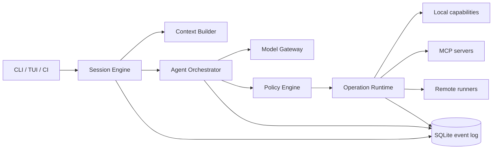

<p align="center"></p>
<h1 align="center">ARSY CODE</h1>
<p align="center">A local, auditable, model-independent software-engineering agent harness.</p>

**ARSY** is the core platform; this repository contains **ARSY CODE**, its terminal interface.

> [!IMPORTANT]
> ARSY CODE is still in the product and architecture design stage. The CLI is not yet available.

## Why ARSY CODE?

A capable coding agent needs more than a model connection and shell access. It must understand repository instructions, preserve long-running context, select the right capability, request approval at the correct boundary, coordinate parallel work, and leave an auditable trail.

- **Provider-neutral** — select models per task without changing the runtime.
- **Policy-first** — every effect passes through permission evaluation, sandboxing, and audit.
- **Durable** — sessions, events, operation results, and checkpoints survive restarts.
- **Composable** — support operations, MCP, skills, hooks, and `AGENTS.md`.
- **Multi-agent** — represent work as a dependency graph with explicit budgets and concurrency limits.
- **Observable** — keep tokens, cost, latency, edits, approvals, and verification traceable.

## Intended experience

```console
$ arsy
ARSY CODE · workspace: ~/code/payments · model: auto

› find the cause of the checkout timeout, make the smallest fix, then run the relevant tests

  ✓ read AGENTS.md and Git status
  ✓ mapped the checkout request flow
  ! approval required: run integration tests with local network access
  → approve once / approve rule / deny
```

```console
arsy                          # interactive TUI
arsy run "fix bug #42"        # non-interactive execution
arsy session list             # find a session to resume
arsy resume <session-id>      # resume a session
arsy review                   # review local changes
arsy auth set anthropic       # store a provider credential as a handle
arsy config explain policy    # show effective config and where it came from
arsy policy explain fs.write  # ask whether an operation would be allowed
arsy mcp add docs --transport stdio --command ...   # manage MCP connections
arsy doctor                   # diagnose the environment
```

The full surface — session, configuration, policy, credentials, connections, extensions, evidence,
and maintenance commands — is specified in [CLI and TUI surface](docs/36-cli-tui.md). ARSY has no
update command; updates come from the installation channel.

## Architecture at a glance



The immutable event log is the source of truth. Models propose actions; policy decides whether they may run directly, require sandboxing or approval, or must be denied.

## Design documents

- [Complete architecture specification](docs/INDEX.md)
- [Product requirements](docs/02-product-requirements.md)
- [System architecture](docs/04-system-architecture.md)
- [Rust workspace and technology choices](docs/05-rust-workspace.md)
- [Competitive research](docs/01-competitive-research.md) and [claim ledger](docs/report-source.md)
- [Accepted ADRs](docs/ADR/)

## Target MVP

1. Interactive TUI and non-interactive execution.
2. Official Anthropic and OpenAI API adapters.
3. File, search, patch, shell, and read-only Git operations.
4. Hierarchical instructions through `AGENTS.md`.
5. Approval policy, workspace sandbox, and audit log.
6. Persistent sessions, resume, context compaction, and token/cost summaries.
7. MCP client support for stdio and Streamable HTTP.

Multi-agent orchestration, remote runners, plugin marketplaces, and a default daemon remain gated on a measured, stable single-agent foundation.

## Security principles

- Model and operation output is always untrusted.
- Read and write are separate capabilities.
- Network, filesystem, process, and credentials have separate policies.
- Destructive commands cannot rely on generic approval.
- Secrets never enter prompts or event logs.
- Every external effect has an operation ID, status, and result evidence.

See the [threat model](docs/29-threat-model.md).

## Status

| Area | Status |
|---|---|
| Product and architecture specification | Complete |
| CLI implementation | Not started |
| Stable API | Not available |

## License

ARSY CODE is an independent open-source project licensed under the [MIT License](LICENSE). It is not affiliated with Anthropic or OpenAI.
