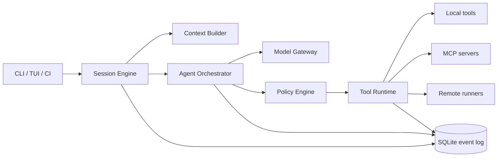

<p align="center">
  
</p>

<h1 align="center">ARSY CODE</h1>

<p align="center">
  Harness agent rekayasa perangkat lunak yang lokal, dapat diaudit, dan tidak terikat satu model.
</p>

**ARSY** adalah core/platform; repository ini berisi **ARSY CODE**, antarmuka terminalnya.

> [!IMPORTANT]
> ARSY CODE masih berada pada tahap desain produk dan arsitektur. CLI belum tersedia untuk digunakan.

## Kenapa ARSY CODE?

Tool coding agent yang bagus tidak cukup hanya bisa memanggil model dan menjalankan shell. Ia harus memahami aturan repo, menjaga konteks panjang, memilih alat yang tepat, meminta izin pada batas yang benar, mengoordinasikan pekerjaan paralel, dan meninggalkan jejak yang dapat diaudit.

ARSY CODE dirancang sebagai harness terminal-first untuk kebutuhan tersebut:

- **Provider-neutral** — model dipilih per tugas tanpa mengubah mesin agent.
- **Policy-first** — setiap tool call melewati evaluasi izin, sandbox, dan audit log.
- **Durable** — sesi, event, hasil tool, dan checkpoint dapat dilanjutkan setelah proses berhenti.
- **Composable** — dukungan bawaan untuk tools, MCP, skills, hooks, dan instruksi `AGENTS.md`.
- **Multi-agent** — pekerjaan dapat dipecah menjadi DAG dengan budget dan batas konkurensi yang jelas.
- **Observable** — penggunaan token, biaya, latensi, perubahan file, approval, dan hasil verifikasi dapat ditelusuri.

## Pengalaman yang dituju

```console
$ arsy
ARSY CODE · workspace: ~/code/payments · model: auto

› telusuri penyebab checkout timeout, buat fix terkecil, lalu jalankan tes terkait

  ✓ membaca AGENTS.md dan status git
  ✓ memetakan alur request checkout
  ! perlu izin: menjalankan integration test dengan akses network lokal
  → approve once / approve rule / deny
```

Mode penggunaan yang direncanakan:

```console
arsy                         # TUI interaktif
arsy run "perbaiki bug #42" # eksekusi non-interaktif
arsy resume <session-id>     # lanjutkan sesi
arsy review                  # review perubahan lokal
arsy mcp list                # kelola integrasi MCP
arsy doctor                  # diagnosis environment
```

## Arsitektur singkat



Mesin inti menggunakan event log sebagai sumber kebenaran. Model hanya mengusulkan aksi; policy engine yang memutuskan apakah aksi boleh langsung berjalan, harus di-sandbox, memerlukan persetujuan, atau ditolak.

## Dokumen desain

- [Dokumen produk](docs/PRODUCT.md) — pengguna, ruang lingkup, fitur, roadmap, dan metrik.
- [Arsitektur](docs/ARCHITECTURE.md) — komponen, alur turn, keamanan, data, dan kegagalan.
- [Tech stack](docs/TECH_STACK.md) — pilihan teknologi, struktur repo, dan urutan implementasi.

## Target MVP

MVP sengaja dibatasi pada satu agent lokal yang solid:

1. TUI interaktif dan mode non-interaktif.
2. Adapter model Anthropic dan OpenAI melalui API resmi.
3. Tools file, pencarian, patch, shell, dan git read-only.
4. Instruksi berjenjang melalui `AGENTS.md`.
5. Approval policy, sandbox workspace, dan audit log.
6. Sesi persisten, resume, compaction, serta ringkasan biaya/token.
7. MCP client untuk STDIO dan Streamable HTTP.

Multi-agent, remote runners, plugin marketplace, dan daemon masuk setelah fondasi single-agent terukur stabil.

## Prinsip keamanan

- Output model dan tool selalu dianggap tidak tepercaya.
- Read dan write adalah capability berbeda.
- Network, filesystem, process, dan credential memiliki policy terpisah.
- Perintah destruktif tidak boleh lolos lewat approval generik.
- Secret tidak dimasukkan ke prompt atau event log.
- Setiap side effect memiliki `call_id`, status, dan bukti hasil.

Detail threat model tersedia di [dokumen arsitektur](docs/ARCHITECTURE.md#model-keamanan).

## Status

| Area | Status |
| --- | --- |
| Product brief | Selesai |
| Arsitektur awal | Selesai |
| Tech stack | Selesai |
| Implementasi CLI | Belum dimulai |
| API stabil | Belum tersedia |

## Referensi

Desain ini mengambil pelajaran dari produk publik tanpa menyalin implementasi atau identitasnya:

- [Claude Code](https://github.com/anthropics/claude-code) — terminal-first coding agent dan ekosistem plugin.
- [Claude Code CLI reference](https://docs.anthropic.com/en/docs/claude-code/cli-usage) — pola sesi dan mode non-interaktif.
- [OpenAI Codex configuration](https://developers.openai.com/codex/config-basic/) — konfigurasi berlapis, approval, dan sandbox.
- [OpenAI Codex AGENTS.md](https://developers.openai.com/codex/guides/agents-md/) — instruksi proyek berjenjang.
- [OpenAI Codex MCP](https://developers.openai.com/codex/mcp/) — integrasi tools dan context melalui MCP.

ARSY CODE adalah proyek independen dan tidak berafiliasi dengan Anthropic maupun OpenAI.
