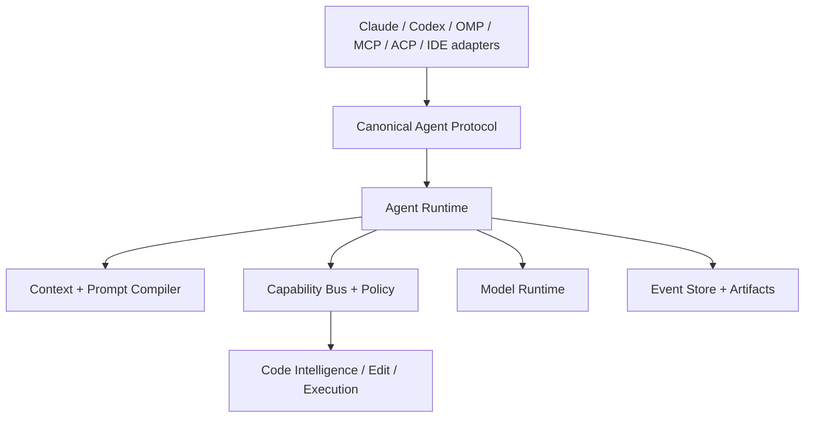

# Vision: a coding-agent operating system

## Problem

Current harnesses often bind chat history, model wire formats, tools, permissions, and UI into one execution loop. That makes provider changes risky, compaction lossy, effects hard to audit, and semantic code work optional.

## Decision

ARSY is a local-first agent operating system: a versioned service coordinates models, context, capabilities, policy, code intelligence, execution, agents, and durable evidence. Claude, Codex, OMP, MCP, ACP, IDEs, and CLIs are edge adapters.

The unit of agency is not a chat or tool call. It is an attributable attempt to advance a goal using a context view and a set of attenuated capabilities against a versioned workspace.

## Product principles

Fast, predictable, powerful, transparent, recoverable, extensible, provider-neutral, secure, and offline-first where the selected model permits. The optimization objective is verified task success per token, unit time, and unit risk—not activity or feature count.

## Moats

| Capability | User impact | Difficulty | Defensibility | Model amplification |
|---|---:|---:|---:|---:|
| Lossless context views over event history | 5 | 5 | 5 | 5 |
| Semantic code-intelligence ladder | 5 | 5 | 5 | 5 |
| Typed effect/capability graph | 5 | 5 | 5 | 4 |
| Model-specific prompt compiler | 4 | 4 | 4 | 5 |
| Transactional hybrid edits | 5 | 4 | 4 | 5 |
| Integrated debugger and verification | 5 | 5 | 4 | 4 |
| Eval-driven routing and improvement | 4 | 5 | 5 | 5 |
| Secure WASM extension runtime | 3 | 5 | 4 | 2 |

Scores are prioritization judgments (**P**), not measurements.

## Anti-goals

ARSY is not a Claude or Codex clone, chat UI with shell access, MCP-shaped core, provider-hack collection, mandatory cloud service, universal filesystem URI façade, autonomous self-modifier, native-plugin free-for-all, worktree-only orchestrator, or monolithic TUI. It will not hide approval scope, discard session evidence, promise identical sandbox guarantees, or expose raw secrets to models.

## Success test

A real repository can be understood, changed, debugged, and verified with attributable evidence; existing ecosystem configuration is imported deterministically; changing model, frontend, or execution target does not rewrite agent logic.
