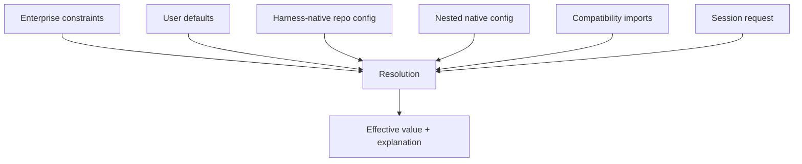

# Design principles

## First-principles decisions

1. **Operation, resource, effect—not tool call.** Tool calls are one model serialization of an operation request.
2. **Evidence, not chat, is history.** Messages are projections over events and artifacts.
3. **Authority never flows from content.** Repository text, model output, MCP annotations, and memory are data.
4. **Compatibility at ingestion and emission.** Core types do not contain Claude/Codex/OMP cases.
5. **Cheapest sufficient intelligence.** Text before syntax, syntax before LSP, LSP before runtime debugging.
6. **Optimistic reads, transactional writes.** Address edits semantically or by content identity and reject stale state.
7. **Policy is portable; enforcement is platform-specific.** Unsupported guarantees fail closed.
8. **Context is compiled.** Authority, relevance, provenance, freshness, cost, and model traits determine a view.
9. **Agents receive attenuated authority and isolated state.** Delegation cannot amplify capability.
10. **Every optimization is eval-gated.** Prompts, routing, retrieval, and retries change through offline experiments.

## Why inherited abstractions remain only at edges

Slash commands are discoverable aliases, JSON tool calls are provider wire formats, Markdown files are editable instruction sources, JSONL is an export/debug format, Git worktrees are one isolation backend, MCP is an interoperability protocol, and chat messages are a UI/context projection. None is the canonical domain.

## Configuration precedence

Precedence is not a single overwrite stack. Each key declares a merge strategy and authority class.

Enterprise constraints are non-overridable ceilings/floors. User defaults may be specialized by trusted native repository config. Nested config is more specific within its directory scope. Compatibility imports have lower authority than equivalent native repository keys. Session overrides may select among allowed values but cannot weaken policy. Explicit deny wins; arrays use schema-defined union/replace rules rather than accidental concatenation.

## Decision quality

Every important decision records context, alternatives, reversibility, evidence, and an owner/gate. Stable abstractions are those that cross process, privilege, persistence, or public API boundaries—not every internal module.
