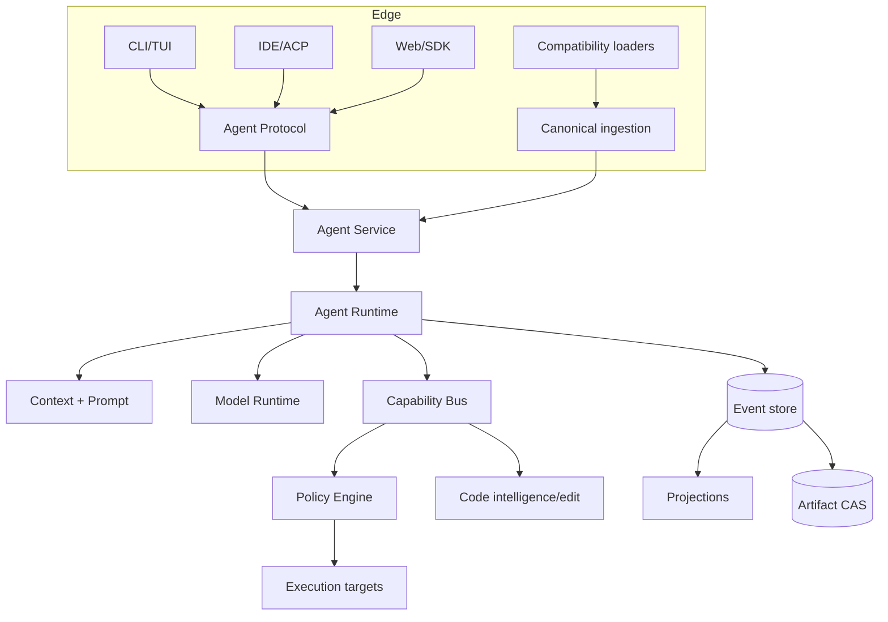
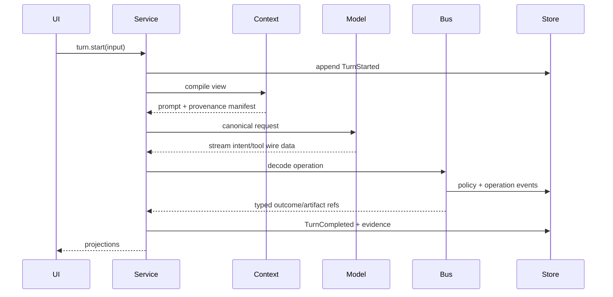

# System architecture

## Problem and requirements

The runtime must let multiple frontends and models operate on durable sessions without giving model adapters or UIs direct mutation authority. It must keep effects auditable, code operations semantic, and compatibility removable.

## Proposed design



The service is the sole session coordinator. The event store is authoritative. Projections serve UI, retrieval, and analytics. Capability executors never trust model-facing schemas; requests are decoded into typed operations, resolved to canonical resources, policy-checked, then dispatched.

## Core interfaces

```rust
pub struct OperationRequest {
    pub id: OperationId,
    pub actor: AgentId,
    pub kind: OperationKind,
    pub resource: ResourceRef,
    pub input: ArtifactRef,
    pub expected: Option<StateVersion>,
}

pub trait OperationExecutor: Send + Sync {
    fn contract(&self) -> &OperationContract;
    fn execute(&self, cx: ExecutionContext, request: OperationRequest)
        -> BoxFuture<'static, Result<OperationOutcome, OperationError>>;
}
```

## User-turn flow



## Failure, security, and performance

Crashes resume from committed events; duplicate requests use idempotency keys; projections rebuild. The service authenticates clients, agents cannot bypass policy, and artifact access is scoped. Hot paths use in-process dispatch; process boundaries are reserved for frontends, sandboxes, plugins, and remote workers. Backpressure applies at streams and event subscribers.

## Alternatives and decision

A single CLI loop is simpler but blocks durable multi-client sessions. Microservices add failure modes without local value. Decision: one Rust service, embeddable initially and daemon-capable, with logical modules extracted into crates only at stable boundaries.

## Open questions

Whether the first release enables daemon mode by default and whether remote clients use WebSocket or gRPC await prototype benchmarks.
