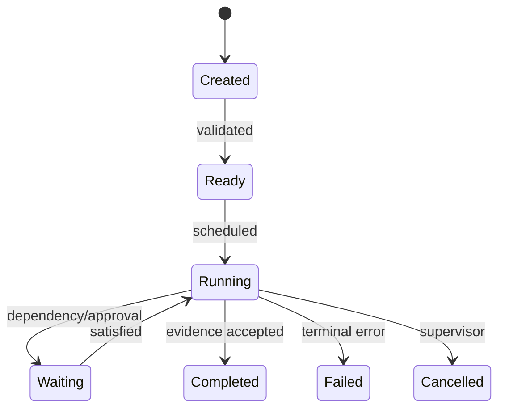

# Agent runtime

Status: target design. The current source has a durable `TaskGraph` and an
authority-attenuated but synchronous `task.spawn`; it does not yet implement the
scheduler state machine below end to end. See [`31-roadmap.md`](31-roadmap.md).

## Problem and existing approaches

Prompt-wrapped subagents lack durable identity, authority attenuation, supervision, and workspace ownership. OMP implements discoverable task agents and isolation policy (**V**); Codex has persisted multi-agent/tool flows (**V**); Claude documents isolated subagents and optional worktrees (**D**).

## Proposed design

```rust
pub struct AgentRecord {
    pub id: AgentId,
    pub parent: Option<AgentId>,
    pub goal: GoalRef,
    pub role: RoleId,
    pub model: ModelRoute,
    pub context_view: ContextViewId,
    pub authority: CapabilitySetId,
    pub workspace: WorkspaceId,
    pub budget: Budget,
    pub status: AgentStatus,
}
```

An agent is a supervised state machine: `Created → Ready → Running ↔ Waiting → {Completed, Failed, Cancelled}`. Every transition is an event. Roles are policy/prompt/model presets, not subclasses.



## Runtime loop

The scheduler selects a model route, compiles context, consumes model events, validates structured intent, invokes operations, records evidence, and stops on goal/limit/policy conditions. Retries require classified transient failure and an idempotency strategy.

## Invariants

- Child authority and budget are subsets of the parent grant.
- One writer owns a mutable workspace view at a time.
- Cancellation propagates downward; completion does not imply child completion unless join policy says so.
- Agent output is untrusted until schema validation and evidence checks pass.
- Model routing cannot silently cross cost, data-residency, or provider policy.

## Failure modes and decision

Runaway loops hit turn/time/token/effect budgets. Lost workers lease and heartbeat; expired work becomes recoverable, not duplicated blindly. Deadlocks surface a dependency-cycle event. Decision: durable state machines with structured results and bounded mailboxes, not nested conversation strings.
