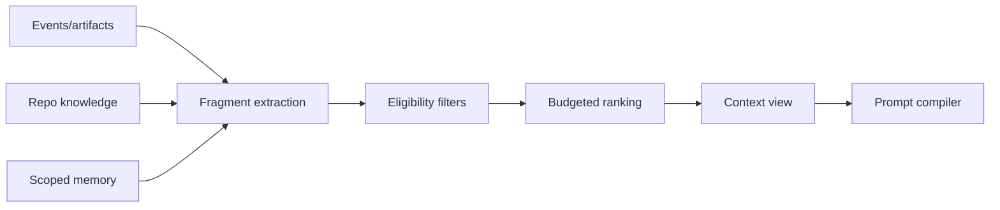
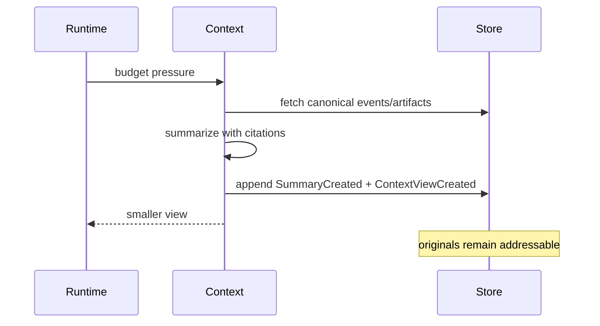

# Context engine

## Problem

A flat message list confuses truth, authority, recency, and relevance. Compaction then deletes detail or lets summaries become indistinguishable from evidence.

## Existing approaches and weaknesses

OMP reconstructs branch context and records compaction entries (**V**). Codex stores raw history separately from queryable projections (**V**). Claude documents auto-compaction and instruction reload (**D**). Each validates the need for views, but ARSY requires explicit provenance and lossless retrieval.

## Data model

```rust
pub struct ContextFragment {
    pub id: FragmentId,
    pub kind: FragmentKind,
    pub source: ResourceRef,
    pub scope: Scope,
    pub content: ArtifactRef,
    pub tokens: u32,
    pub authority: Authority,
    pub confidence: Confidence,
    pub freshness: Freshness,
    pub dependencies: Vec<FragmentId>,
}

pub struct ContextView {
    pub id: ContextViewId,
    pub fragments: Vec<FragmentId>,
    pub render_order: Vec<FragmentId>,
    pub omissions: Vec<OmissionReason>,
    pub budget: TokenBudget,
}
```

## Selection

Hard constraints first: trust boundary, task scope, provider residency, required instructions, unresolved tool state, and token budget. Then deterministic ranking combines dependency, authority, relevance, recency, confidence, novelty, and token cost. Exact scores and omissions are recorded. Summaries point to covered events and never replace them.



## Compaction sequence



## Failure, security, performance

Poisoned summaries are marked derived and can be regenerated; stale diagnostics carry revision IDs; retrieval failures expose omissions. Secret scanning and data-residency filters run before rendering. Token estimation is cached by model tokenizer; incremental fragment indexes avoid full-session scans.

## Alternatives and open questions

Vector-only retrieval loses authority and exact evidence; entire history wastes tokens; model-selected context lets untrusted output shape its own authority. Hybrid lexical/symbol/graph/embedding retrieval is accepted, with embeddings optional and eval-gated. Optimal score weights remain empirical.
