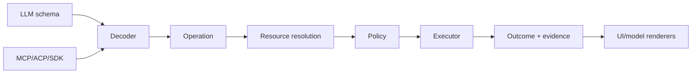

# Operation and capability system

## Problem

“Tool” conflates an LLM schema, an internal command, permission requirements, implementation, rendering, and telemetry. Filesystem and GitHub access both may appear as tools but have different consistency and trust semantics.

## Canonical model

```rust
pub struct OperationContract {
    pub kind: OperationKind,
    pub input_schema: SchemaRef,
    pub output_schema: SchemaRef,
    pub effects: Vec<EffectTemplate>,
    pub idempotency: Idempotency,
    pub concurrency: ConcurrencyRule,
}

pub struct CapabilityRequirement {
    pub action: CapabilityAction,
    pub resource: ResourcePattern,
    pub constraints: ConstraintSet,
}

pub struct OperationOutcome {
    pub value: ArtifactRef,
    pub observed_effects: Vec<Effect>,
    pub evidence: Vec<EvidenceRef>,
    pub state: Option<StateVersion>,
}
```

Model-facing tools are generated views of eligible operations. MCP tools, slash commands, IDE actions, and programmatic SDK calls decode into the same request. UI renderers consume typed outcomes and artifacts.



## Shell special case

Shell input is an effect program, not an opaque ordinary tool. The runtime parses command segments where possible, predicts requirements, obtains policy decisions, then executes under a sandbox that enforces the actual ceiling. Static parsing is advisory because shells are dynamic; observed effects and violations remain authoritative.

## Failure, security, performance

Schema decode failures never reach executors. Resource canonicalization resolves symlinks and race-resistant handles before policy. Executor registration rejects duplicate operation IDs. Dispatch is a direct indexed call; policy caches only decisions whose inputs and resource versions match.

## Compatibility and alternatives

Compatibility adapters regenerate familiar names/schemas. A universal URI identifies resources but never erases scheme-specific operations. The conventional `Tool` trait is retained only at edges; the canonical decision is `Operation + Resource + Effect + Capability`.
