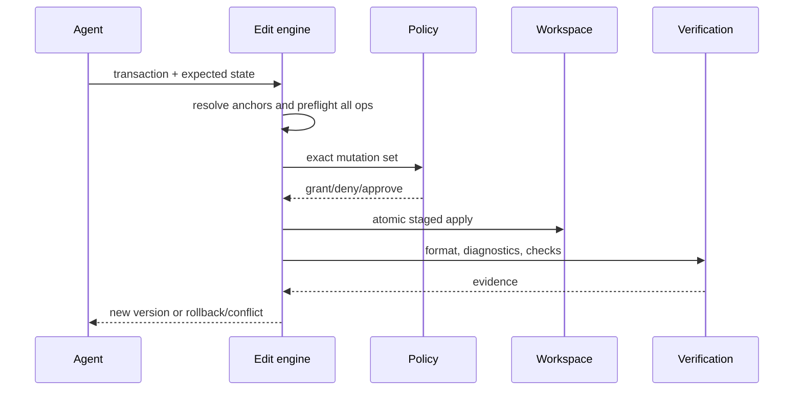

# Edit engine

## Problem

Search/replace is ambiguous, line numbers drift, full rewrites destroy unrelated changes, unified diffs are brittle, AST edits lose formatting, and LSP edits can be stale.

## Hybrid transaction

```rust
pub enum EditAddress {
    ContentAnchor { before: Digest, after: Digest },
    TextAnchor { needle: String, occurrence: NonZeroU32 },
    SyntaxNode { tree: TreeVersion, node: NodeId },
    Symbol { index: IndexVersion, symbol: SymbolId },
    WorkspaceEdit { server: ServerId, revision: StateVersion },
    ByteRange { revision: StateVersion, start: u64, end: u64 },
}

pub struct EditTransaction {
    pub base: WorkspaceVersion,
    pub operations: Vec<EditOperation>,
    pub postconditions: Vec<Postcondition>,
}
```

Operations include create/delete/move file, replace/insert/delete range, replace/rename/move symbol, apply patch, AST transform, and LSP workspace edit.



## Invariants

No partial multi-file batch, no mutation after base mismatch, no formatter change outside declared/approved scope without reporting, and every output file has before/after digests. Deletion is separately authorized. Symlink targets are resolved safely.

## Failure and performance

Ambiguous anchors return candidates; stale symbols trigger re-resolution and require semantic identity match; formatter/test failures preserve a recoverable staged diff rather than hiding work. Small text edits avoid parsing; syntax/LSP is used only when it reduces risk. Hashing is incremental and snapshots use copy-on-write or reflinks where available.

## Decision

Use content-bound optimistic concurrency plus the strongest available semantic address. Unified patch remains import/export; full-file writes are permitted only with exact base hash.
