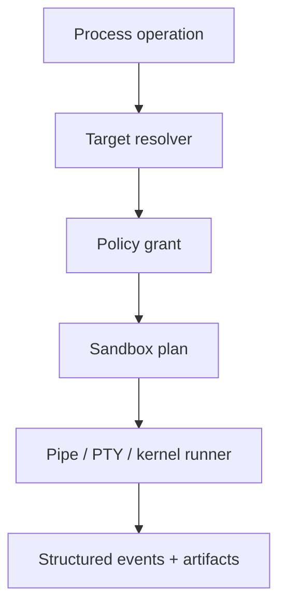

# Execution runtime

## Problem

Shell syntax, process lifecycle, PTYs, sandboxing, persistent REPLs, and remote execution are distinct concerns. Treating all of them as one command string prevents precise policy and recovery.

## Interfaces

```rust
pub trait ExecutionTarget: Send + Sync {
    fn describe(&self) -> TargetDescriptor;
    fn spawn(&self, spec: ProcessSpec, grant: CapabilityGrant)
        -> BoxFuture<'_, Result<ProcessHandle, ExecError>>;
    fn filesystem(&self) -> &dyn TargetFilesystem;
}

pub struct CommandResult {
    pub status: ExitStatus,
    pub stdout: ArtifactRef,
    pub stderr: ArtifactRef,
    pub duration: Duration,
    pub truncated_view: bool,
    pub observed_effects: Vec<Effect>,
    pub policy_events: Vec<EventId>,
}
```

Local, SSH, container, Kubernetes, and remote-worker targets implement the same primitives, but publish different assurance and feature descriptors. Shell expands a command language; direct process spawn is preferred when shell features are unnecessary. PTY and pipe processes are separate modes. Persistent sessions have leases, input sequence numbers, output cursors, and explicit termination.



## Failure, security, performance

Output is streamed to bounded artifacts, never accumulated unbounded in memory. Timeouts send graceful termination then forced kill according to policy. Orphan cleanup is recorded. Environment starts from an allowlist; credentials are brokered handles. Remote targets authenticate mutually and bind results to target identity and workspace version.

## Alternatives and decision

One `sh -c` API is portable-looking but unsafe and loses structure. Language kernels are optional execution adapters, not core dependencies. Decision: separate target, process, shell, PTY, and sandbox contracts.
