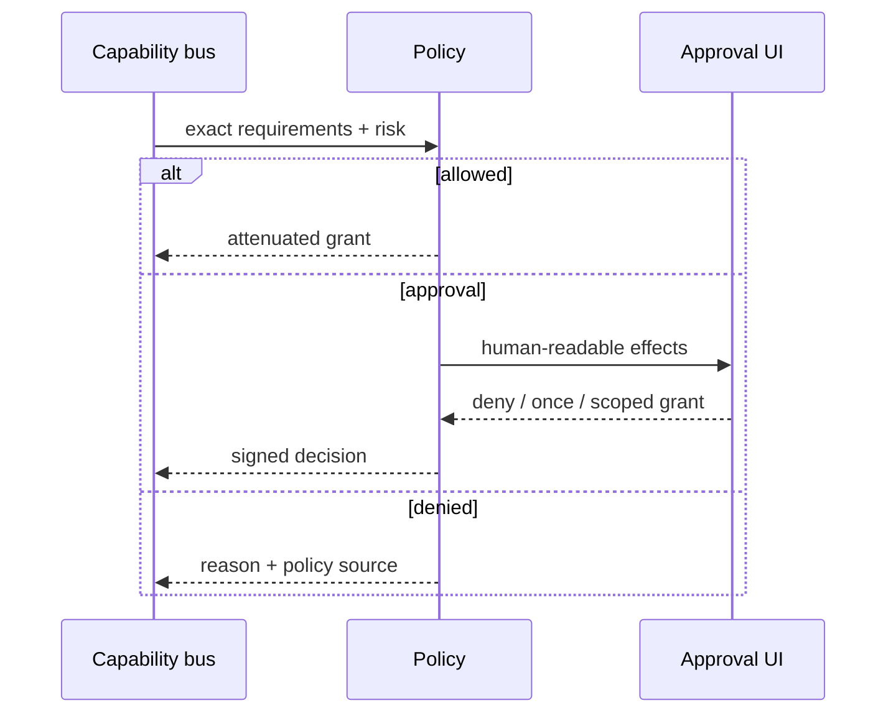

# Policy and permissions

## Problem

Tool allowlists are too coarse. A permitted shell can delete files, connect to networks, read credentials, or modify Git. Approval UI must not become the policy engine.

## Capability vocabulary

Actions include `fs.read`, `fs.write`, `fs.delete`, `process.exec`, `process.signal`, `network.connect`, `git.read`, `git.write`, `credential.use`, `browser.control`, `debug.launch`, `debug.attach`, `remote.exec`, `system.modify`, and `plugin.invoke`. Grants bind actions to canonical resource patterns, constraints, expiry, actor, and delegation depth.

```rust
pub struct PolicyQuery {
    pub actor: Principal,
    pub operation: OperationKind,
    pub requirements: Vec<CapabilityRequirement>,
    pub context: RiskContext,
}

pub enum PolicyDecision {
    Allow(CapabilityGrant),
    RequireApproval(ApprovalRequest),
    Deny(DenialReason),
}
```

## Resolution

Enterprise policy sets immutable deny floors and required controls. User policy supplies defaults and grants. Repository policy may tighten or request behavior but cannot self-grant. Session requests select within those bounds. Child agents receive intersections of parent grant and requested scope. Explicit deny wins.

Risk uses operation class, resource scope, network destination, reversibility, workspace cleanliness, model confidence only as weak evidence, test coverage, blast radius, and sandbox assurance. Low-risk/high-evidence work may auto-run; medium risk runs sandboxed with verification; high-risk or irreversible work requires approval or is denied.



## Security and failure

Rules compile to a deterministic normalized form and return an explanation trace. Glob/path/command parsers are fuzzed. Approval is bound to exact operation digest and expires on mutation. Cached grants cannot exceed their original constraints. Hooks can deny or request approval but cannot grant authority.

## Compatibility

Claude permission rules and Codex approval/sandbox policies translate into this vocabulary with diagnostics for lossy mappings. Unknown constructs fail closed in enforcement contexts.
