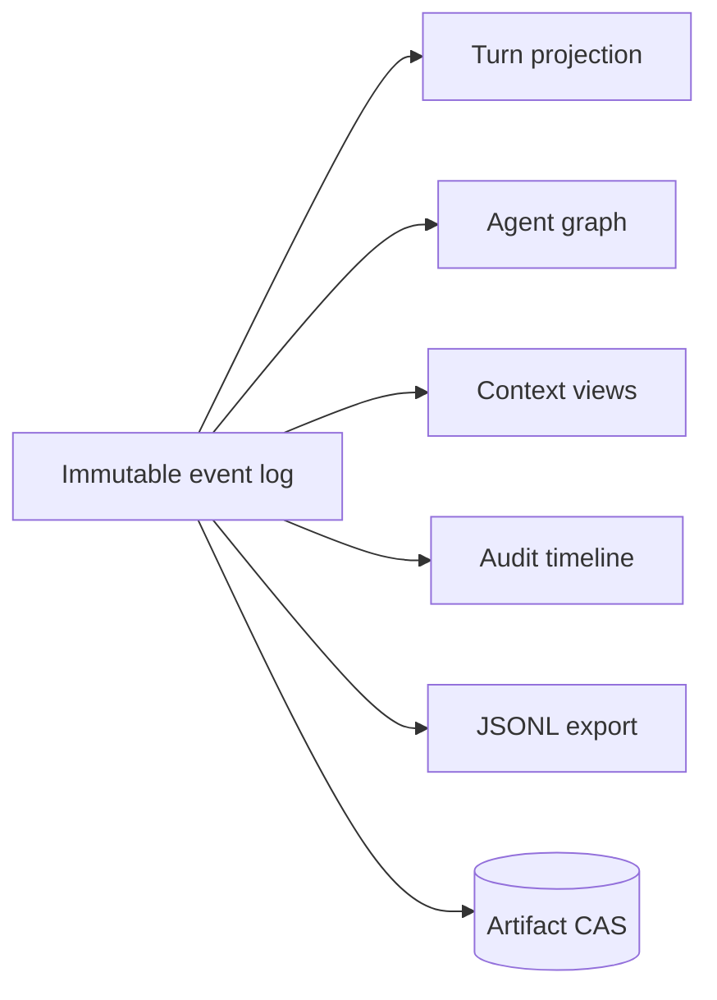

# Lossless session persistence

## Problem and existing approaches

JSONL is inspectable but weak for transactions and queries. OMP preserves append-oriented branch lineage (**V**); Codex separates thread history, metadata, rollout files, SQLite, and diagnostic traces (**V**). Compaction must never erase canonical evidence.

## Design

SQLite in WAL mode stores immutable event envelopes and transactional indexes. A content-addressed artifact store holds large or binary payloads. Projections—turns, agent graph, context views, UI feeds, token totals—are rebuildable.

```rust
pub struct EventEnvelope {
    pub id: EventId,
    pub session: SessionId,
    pub sequence: u64,
    pub occurred_at: Timestamp,
    pub actor: Principal,
    pub causation: Option<EventId>,
    pub correlation: CorrelationId,
    pub schema: SchemaVersion,
    pub payload: EventPayload,
}

pub trait EventStore: Send + Sync {
    fn append(&self, expected: StreamVersion, events: Vec<EventEnvelope>)
        -> BoxFuture<'_, Result<StreamVersion, StoreError>>;
    fn read(&self, stream: SessionId, from: u64)
        -> BoxStream<'_, Result<EventEnvelope, StoreError>>;
}
```



Resume replays after the latest verified checkpoint. Rewind creates a new branch pointing to an earlier event; it does not truncate. Fork records ancestry. Resume, rewind, fork, and JSONL export are reached through [`arsy resume` and `arsy session`](36-cli-tui.md); unreachable artifacts past retention are collected by `arsy gc`. Migrations are explicit, checksum-verified, backed up, and reversible where possible. UI preferences live separately and reference session IDs.

## Failure, security, performance

Optimistic stream versions prevent concurrent writers. Artifact writes complete before referencing events; garbage collection follows reachability plus retention. Durability levels (`memory`, `normal`, `strict`) are explicit. Encrypt sensitive artifacts where platform key storage is available; redact exports by policy. One SQLite writer is acceptable initially; batching and WAL preserve concurrent reads.

## Alternatives and decision

Pure JSONL remains an export/debug format; a custom log database is unnecessary. Decision: SQLite + CAS, immutable canonical events, rebuildable projections, lossless context views.
