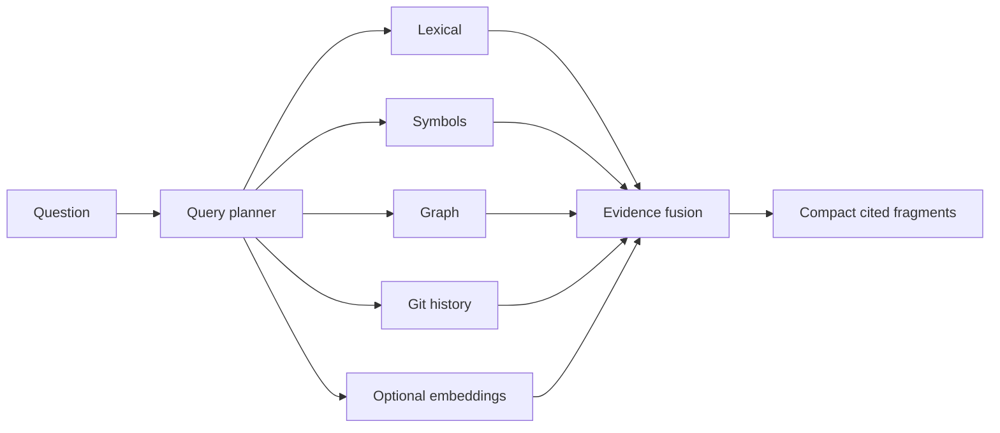

# Memory and repository knowledge

## Problem

Memory without scope, provenance, or correction turns old model guesses into durable prompt injection. Re-indexing every repository wastes time; embedding-only retrieval misses exact code relationships.

## Memory model

Scopes are working, session, task, repository, branch, user, and team. Learned heuristics are a separate experimental class. Repository facts never automatically become user memory.

```rust
pub struct MemoryRecord {
    pub id: MemoryId,
    pub scope: MemoryScope,
    pub claim: ArtifactRef,
    pub provenance: Vec<EvidenceRef>,
    pub confidence: Confidence,
    pub created_at: Timestamp,
    pub updated_at: Timestamp,
    pub expires_at: Option<Timestamp>,
    pub status: MemoryStatus,
}
```

Users and verified contradictions can supersede or revoke a memory; deletion creates a tombstone for audit and removes it from retrieval. Secret-like content is rejected or stored only in the credential subsystem.

## Repository graph and retrieval

The graph uses stable content/symbol identities where possible and revision-bound fallbacks otherwise. Filesystem events and Git diffs invalidate nodes; tree-sitter updates syntax; LSP and build adapters enrich semantics. Retrieval combines exact/lexical search, symbols, graph traversal, Git history, optional local/approved embeddings, recency, and scope.



## Failure, security, performance

Every hit carries provenance, revision, confidence, and freshness. Conflicts are returned, not averaged away. Repository text cannot create trusted memory. Embedding providers require data-egress permission. Incremental indexes are content-addressed; startup loads metadata lazily and prioritizes the working set.

## Decision and open questions

Use metadata-first hybrid retrieval and optional embeddings. Do not build a global “agent brain.” Graph schema expansion, embedding value, and retention defaults require eval evidence.
