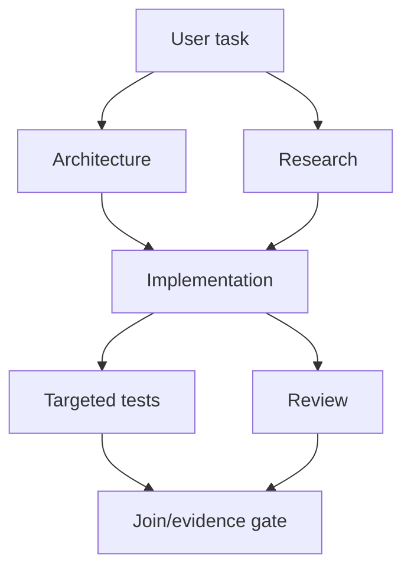

# Agent orchestration

Status: target architecture. For the source-audited implementation boundary and
delivery sequence, see [`31-roadmap.md`](31-roadmap.md). In particular, the
current `task.spawn` path is synchronous and does not yet bind children to the
workspace isolation described below.

## Problem

Parallel conversations share hidden state, duplicate work, and corrupt files. Orchestration needs durable dependencies, supervision, budgets, and workspace isolation.

## Agent graph

```rust
pub struct TaskNode {
    pub id: TaskId,
    pub goal: GoalRef,
    pub dependencies: Vec<TaskId>,
    pub assignee: Option<AgentId>,
    pub required_output: SchemaRef,
    pub workspace: WorkspaceRequirement,
    pub budget: Budget,
}
```



Agents communicate through typed task results, findings, evidence references, and bounded messages. A supervisor schedules ready nodes, cancels descendants, detects cycles, and applies join policies. Planner, researcher, implementer, debugger, reviewer, security reviewer, test writer, performance reviewer, architect, migration, and documentation roles are presets; each may route to a different model.

## Workspace isolation

Read-only agents share an immutable snapshot. A writer gets a dedicated Git worktree by default in Git repositories; non-Git work uses a copied/reflink snapshot. The abstraction records repository, base revision, filesystem view, Git state, and isolation backend. Merge is a typed operation with conflict evidence. Overlay/COW filesystems are P3 until benchmarks justify them.

## Observers

Security, correctness, requirement, cost, context, test, and architecture observers consume redacted event projections. They may suggest; only policy-authorized observers can deny. They cannot execute operations or increase authority. Streaming intervention becomes a recorded rule event and bounded retry.

## Failure and performance

Leases recover crashed agents; duplicate completion is idempotent; dependency cycles fail visibly; budget exhaustion returns partial structured evidence. Parallelism is capped by provider, CPU, memory, and workspace constraints. Delegation is used only when expected value exceeds context, coordination, and merge cost.

## Decision

Persist a supervised task graph and isolate writers. Subagents are runtime entities, not prompt wrappers.
