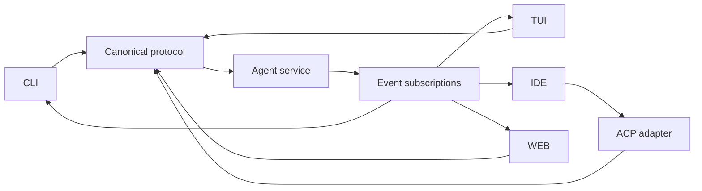

# Canonical agent protocol

## Problem

Frontends must not couple to runtime internals, and third-party protocol concepts must not dictate canonical state.

## Primitives

Workspace, Session, Turn, Item, Agent, Task, Operation, Artifact, Finding, Approval, ContextView, Checkpoint, Event, and Subscription have stable IDs. Items are projections suitable for presentation; events are canonical facts.

```rust
pub enum ClientRequest {
    WorkspaceOpen(WorkspaceOpen),
    SessionCreate(SessionCreate),
    SessionResume(SessionResume),
    TurnStart(TurnStart),
    ApprovalResolve(ApprovalResolution),
    AgentControl(AgentControl),
    ArtifactRead(ArtifactRead),
    Subscribe(Subscribe),
}

pub struct ProtocolEnvelope<T> {
    pub protocol: ProtocolVersion,
    pub request_id: RequestId,
    pub idempotency_key: Option<IdempotencyKey>,
    pub payload: T,
}
```

## Transport

The semantic protocol is transport-neutral. Initial transports are stdio JSON lines for embedding and Unix socket/named pipe for local daemon; [`arsy serve`](36-cli-tui.md) is the entry point and defaults to stdio. WebSocket serves remote/event-stream clients after authentication. gRPC is deferred until streaming/interoperability evidence outweighs schema duplication.



## Versioning and failure

Protocol major versions negotiate at initialization; minor features use capabilities. Unknown optional fields are preserved where safe; unknown variants fail clearly. Requests are idempotent where declared, subscriptions resume from sequence cursors, and slow clients receive bounded snapshots plus a gap event. Generated JSON Schema and Rust/TypeScript bindings are conformance-tested.

## Security and decision

Local peers authenticate through OS identity/socket permissions; remote clients use mutually authenticated channels and scoped tokens. Approval resolution is bound to user identity and request digest. Decision: one canonical semantic protocol, with Codex app-server, ACP, and MCP mappings at edges.
