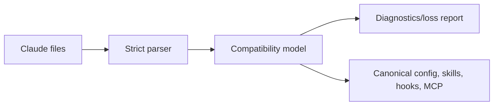

# Claude Code compatibility

## Evidence boundary

Claude runtime behavior below is publisher-documented (**D**); its public repository does not expose inspected core implementation (**V**). Compatibility is behavioral and fixture-tested, not architectural mimicry.

## Discovery and precedence

Import `CLAUDE.md`, nested instruction files, `.claude/settings.json`, `.claude/settings.local.json`, commands, skills, agents, hooks, plugin manifests, and `.mcp.json`. Follow documented root-to-working-directory instruction scope and user/project/local/managed settings concepts, then translate them into ARSY’s authority-aware resolver. `CLAUDE.md` imports are resolved with cycle/depth limits and explicit external-file consent.

## Mapping

| Claude surface | ARSY target |
|---|---|
| CLAUDE.md | attributed instruction fragments |
| command / skill | command alias / progressively loaded skill |
| agent | role + prompt + model preference + attenuated capability request |
| hook | lifecycle hook with declared effect class |
| plugin manifest | compatibility package; data/declarations imported, code sandboxed/quarantined |
| permission rule | capability-policy rule |
| `.mcp.json` | MCP connection definitions, approval retained |
| worktree isolation | workspace backend request |

## Live resolution

ARSY reads the operator's Claude Code setup on every launch rather than asking
for it to be copied, through the `arsy-compat` crate (`crates/arsy-compat/src/claude/`):

| Source | Applied as |
|---|---|
| `~/.claude.json` `projects["<root>"].mcpServers`, `.mcp.json`, `~/.claude.json` `mcpServers` | MCP connections, first declaration of a name wins |
| `permissions.allow` / `ask` / `deny` in `~/.claude/settings.json`, `.claude/settings.json`, `.claude/settings.local.json` | policy rules under `compat/claude/…` ids |
| `model` in the same files | fallback model for an Anthropic endpoint that names none |
| `CLAUDE.md` beside `AGENTS.md`, and `$CLAUDE_CONFIG_DIR/CLAUDE.md` | instruction fragments, the operator's first |
| hooks in the settings files | lifecycle hooks, in `arsy run` and the TUI |

`CLAUDE_CONFIG_DIR` moves both `~/.claude` and `~/.claude.json`. `${VAR}` and
`${VAR:-default}` in a server's command, arguments, env, URL, and headers are
expanded; env and header values are passed to the server and never printed. A
server whose variable is unset stays off and says which.

A repository's servers start only in a trusted project, and a repository file
may not place the operator's variables into a URL or header. A permission is
kept only as precisely as ARSY enforces it: a process is matched by program, so
`Bash(git push:*)` asks before every `git` rather than denying `git` or allowing
more, with a note. An alias such as `model = "opus"` is noted, not guessed.
`[compat.claude] enabled = false` removes all of it. `fixtures/compat/live` pins
the resolved view.

## Safety and fidelity

Repository configuration is untrusted and cannot grant itself capabilities. Hooks cannot bypass denial. Commands and model fields are parsed as data, never interpolated into a shell without policy. Unknown keys produce diagnostics; security-sensitive unknowns fail closed. [`arsy compat explain claude`](36-cli-tui.md) shows source, precedence, canonical mapping, and loss.

## Acceptance and open questions

Golden repositories test nested instructions, settings precedence, skills, hooks, agents, plugins, and MCP. Exact private session formats and undocumented plugin execution are out of scope. Compatibility levels are `parsed`, `mapped`, `behavior-tested`, and `unsupported`—never a blanket boolean.
