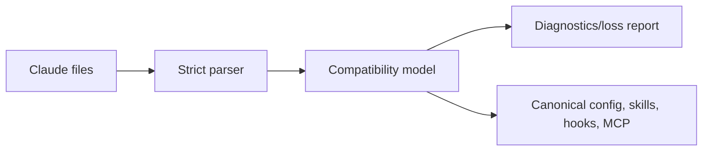

# Claude Code compatibility

## Evidence boundary

Claude runtime behavior below is publisher-documented (**D**); its public repository does not expose inspected core implementation (**V**). Compatibility is behavioral and fixture-tested, not architectural mimicry.

## Discovery and precedence

Import `CLAUDE.md`, nested instruction files, `.claude/settings.json`, `.claude/settings.local.json`, commands, skills, agents, hooks, plugin manifests, and `.mcp.json`. Follow documented root-to-working-directory instruction scope and user/project/local/managed settings concepts, then translate them into ARSY’s authority-aware resolver. `CLAUDE.md` imports are resolved with cycle/depth limits and explicit external-file consent.

## Mapping

| Claude surface | ARSY target |
|---|---|
| CLAUDE.md | attributed instruction fragments |
| command / skill | command alias / progressively loaded skill |
| agent | role + prompt + model preference + attenuated capability request |
| hook | lifecycle hook with declared effect class |
| plugin manifest | compatibility package; data/declarations imported, code sandboxed/quarantined |
| permission rule | capability-policy rule |
| `.mcp.json` | MCP connection definitions, approval retained |
| worktree isolation | workspace backend request |

## Safety and fidelity

Repository configuration is untrusted and cannot grant itself capabilities. Hooks cannot bypass denial. Commands and model fields are parsed as data, never interpolated into a shell without policy. Unknown keys produce diagnostics; security-sensitive unknowns fail closed. `arsy compat explain claude` should show source, precedence, canonical mapping, and loss.

## Acceptance and open questions

Golden repositories test nested instructions, settings precedence, skills, hooks, agents, plugins, and MCP. Exact private session formats and undocumented plugin execution are out of scope. Compatibility levels are `parsed`, `mapped`, `behavior-tested`, and `unsupported`—never a blanket boolean.
