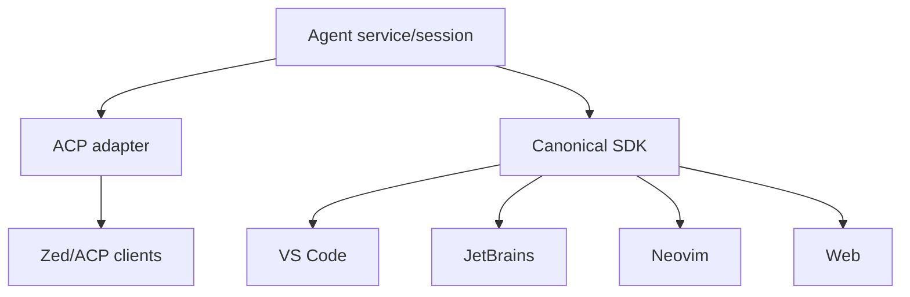

# IDE integration

## Problem

Separate terminal and editor sessions create divergent context and approvals. Editor-specific runtime coupling multiplies work.

## Design

The same service session supports terminal, IDE, web, and remote clients. ACP is the first generic editor adapter. Thin VS Code, JetBrains, Zed, and Neovim integrations render protocol projections, submit turns, resolve approvals, open artifacts/locations, and expose editor capabilities.

IDE filesystem and terminal requests remain client-delegated operations with policy. Unsaved buffers use overlay versions and never masquerade as disk state. Diagnostics and edits carry document versions. A client may observe, propose, approve, or control depending on authenticated role.

## Failure and security

Reconnect resumes from event cursor. Competing controllers use an explicit control lease; approvals record identity. Untrusted workspace extensions cannot impersonate the user or read provider credentials. File locations are canonicalized; links to external resources require consent.

## Decision and open questions

Build ACP plus one reference thin client before bespoke integrations. Shared-control collaboration is deferred; read-only observation and explicit handoff come first.
