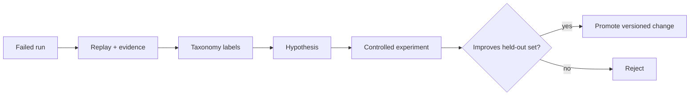

# Evaluation and benchmark system

## Objective

Optimize verified task success per token, latency, cost, and intervention. Harness changes are promoted through reproducible offline evaluation, never by self-modifying production prompts.

## Suite

Tasks cover single-file fixes, multi-file refactors, exploration, diagnosis, DAP debugging, test repair, dependency/API migrations, security and performance fixes, conflicts, ambiguity, long sessions, and parallel work. Each fixture pins repository revision, environment image, allowed capabilities, hidden tests, success rubric, and timeout.

| Outcome metrics | Efficiency metrics | Safety metrics |
|---|---|---|
| tests, semantic rubric, regressions | tokens, cache, latency, cost, calls, retries | denials, unnecessary approvals, violations, secret exposure |

Run a model × harness matrix across ARSY and legally/technically practical Codex, Claude Code, and OMP configurations. Record exact versions, prompts/config where observable, and uncertainty; never claim apples-to-apples when hidden behavior differs.

## Failure taxonomy

Retrieval, context selection, compaction, planning, model reasoning/hallucination, tool selection, schema, policy/approval, sandbox, execution, edit, stale-write, verification, coordination, protocol, provider, and UX failure. A failure may have primary and contributing classes with evidence.

## Statistical discipline

Use repeated trials, confidence intervals, paired tasks, held-out sets, and cost-normalized reports. Seed what can be seeded; preserve raw events and environment manifests. Avoid ranking tiny differences. Security regressions are hard gates even if average task score improves.

## Decision

Keep the existing [`arsy eval`](36-cli-tui.md) runner and extend it in roadmap
Phase 4. The current runner has arms, trials, revision checks, Wilson intervals,
and token/safety fields, but does not isolate/reset each trial or establish
competitor-equivalent execution. Those are required before advanced routing,
memory, or multi-agent superiority claims.
