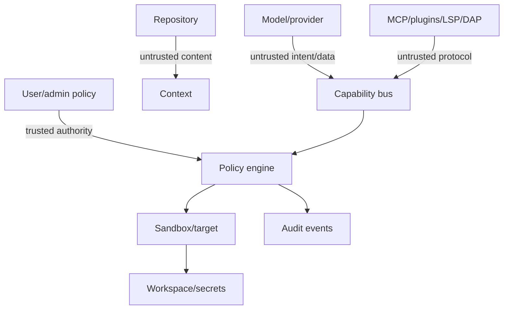

# Security threat model

## Assets and trust boundaries

Assets: source/history, credentials, user data, session evidence, model/provider accounts, execution hosts, release integrity, and collaborator identity. Untrusted principals include repository content, model output, MCP servers, plugins, language/debug servers, command output, remote workers, and collaboration clients.

## Threats and controls

| Threat | Primary controls |
|---|---|
| prompt/repository injection | authority labels, capability mediation, provenance, isolated instructions |
| malicious MCP/tool output | untrusted schemas/annotations, size limits, sanitization, policy |
| malicious plugin | WASM capability imports, fuel/memory/time limits, signatures and review |
| credential theft | secret broker handles, redaction, network scopes, no prompt exposure |
| command injection | typed argv, shell-specific parsing, sandbox ceiling, exact approvals |
| path traversal/symlink race | handle-based canonicalization, root confinement, revalidation |
| sandbox escape | defense in depth, minimal worker, patching, no silent fallback |
| poisoned memory | provenance/confidence/scope, revocation, contradiction handling |
| dependency poisoning | lockfiles, SBOM, provenance, scanning, review, reproducible releases |
| remote impersonation | mutual authentication, scoped tokens, target attestation where available |
| collaboration compromise | role/lease, end-to-end scoped authorization, no provider credentials |
| replay/confused deputy | nonces, operation digests, actor-bound grants, idempotency keys |
| denial of service | quotas, bounded parsers/queues/output, cancellation, worker isolation |

## Supply chain

Pin dependencies and toolchains, generate SPDX/CycloneDX SBOM, sign releases and provenance, scan advisories/licenses, minimize build scripts and `unsafe`, review grammar/adaptor binaries, secure update channels, and optionally require plugin signatures. Reproducible builds are a target verified per platform.

## Residual risk and incident response

No sandbox makes hostile local code harmless. UI presents assurance and data egress. Security events preserve evidence without secrets; credentials can be revoked; plugins/providers can be quarantined; session export supports forensic review.
