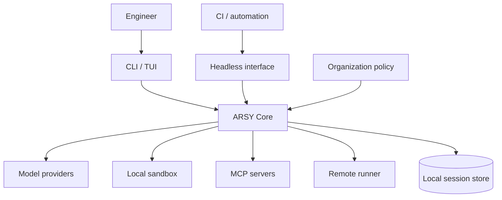
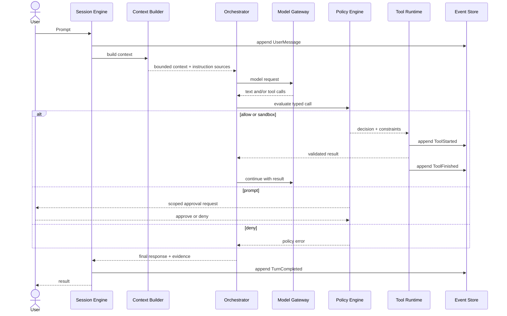
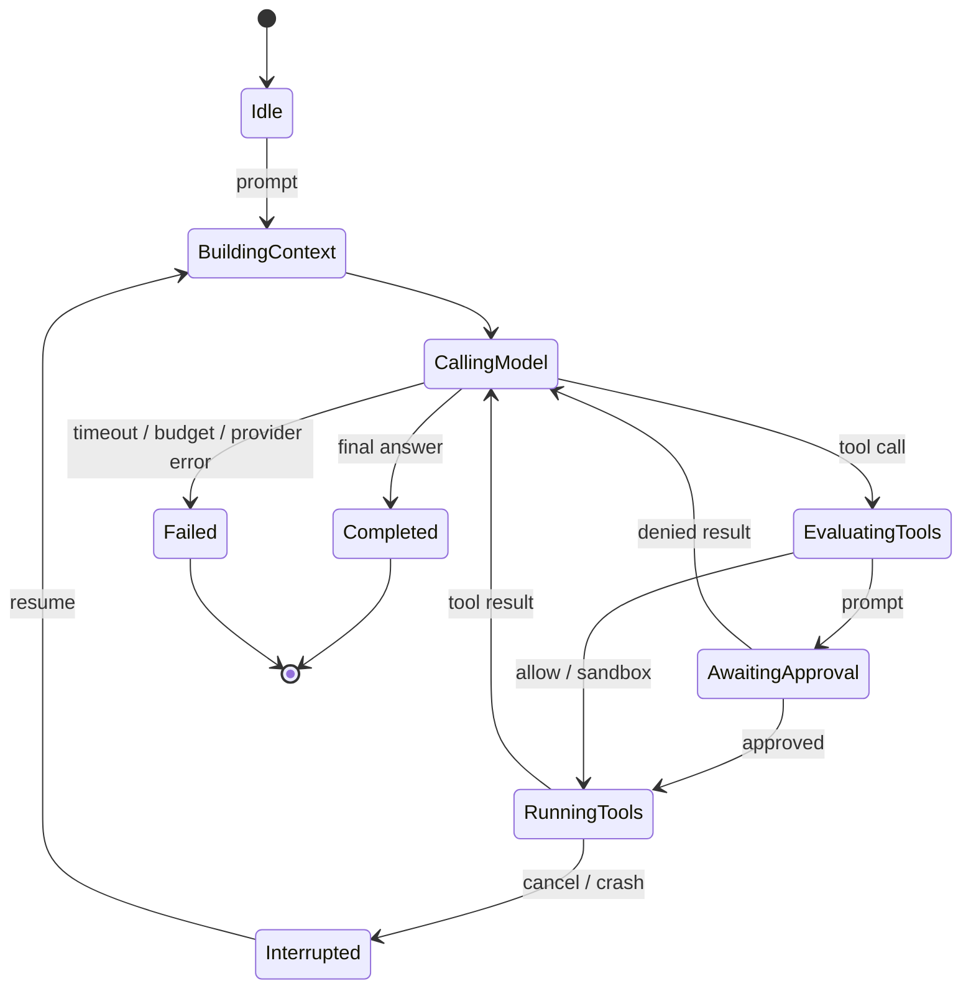
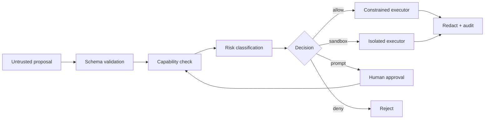
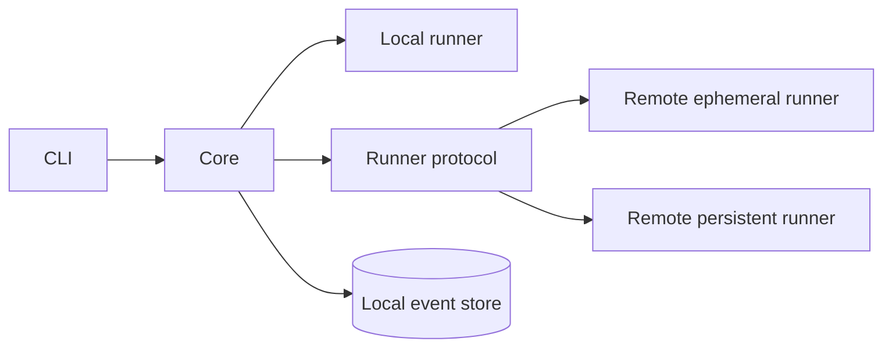

# Arsitektur ARSY

## Tujuan arsitektur

ARSY memisahkan reasoning yang probabilistik dari kontrol yang deterministik. Model boleh memilih rencana dan mengusulkan tool call; runtime memegang otorisasi, eksekusi, persistence, budget, dan bukti.

Prioritas desain:

1. Safety dan recoverability.
2. Kontrak internal yang provider-neutral.
3. Local-first dengan jalur remote yang kompatibel.
4. Observability tanpa membocorkan secret.
5. Single-agent sederhana sebelum orkestrasi paralel.

## Konteks sistem



Trust boundary utama berada antara ARSY Core dan semua input eksternal: model, isi repository, output command, MCP response, remote runner, serta prompt pengguna.

## Komponen

| Komponen | Tanggung jawab | Tidak bertanggung jawab atas |
| --- | --- | --- |
| Interface | Input, streaming output, approval UX, cancel, resume | Policy decision |
| Session Engine | Lifecycle sesi, event append, checkpoint, replay | Memilih tool |
| Context Builder | Instruksi, file context, compaction, token budget | Otorisasi |
| Agent Orchestrator | Turn loop, task DAG, model/tool routing, budget | Menjalankan OS command langsung |
| Model Gateway | Adapter provider, streaming, retry, capability map | Business policy |
| Policy Engine | Capability, scope, risk, approval, deny | Reasoning berbasis model |
| Tool Registry | Typed tool schema, discovery, versioning | Eksekusi process |
| Tool Runtime | Validation, timeout, output cap, redaction, idempotency | Membuat policy sendiri |
| Runner | Local sandbox atau remote execution | Menentukan tujuan agent |
| Event Store | Event atomik, query, export, retention | Menjadi tempat secret |
| Telemetry | Metrics, traces, diagnostic bundle | Menyimpan prompt mentah secara default |

## Alur satu turn



Turn berhenti ketika model memberi hasil final, user membatalkan, budget habis, policy menolak aksi wajib, timeout tercapai, atau iteration limit terlewati.

## State machine



## Kontrak inti

Kontrak menggunakan tipe internal milik ARSY; payload vendor diterjemahkan di adapter.

```rust
struct ToolCall {
    call_id: String,
    tool: String,
    arguments: serde_json::Value,
}

enum PolicyDecision {
    Allow(Constraints),
    Sandbox(Constraints),
    Prompt(ApprovalRequest),
    Deny(PolicyReason),
}

struct ToolResult {
    call_id: String,
    status: ToolStatus,
    content: Vec<ContentBlock>,
    evidence: Evidence,
}
```

Schema nyata harus versioned dan divalidasi pada boundary. Contoh di atas menjelaskan bentuk, bukan API stabil.

## Event dan persistence

SQLite memakai append-only event table sebagai sumber kebenaran, ditambah projection untuk query cepat.

Event minimum:

- `SessionStarted`, `UserMessage`, `ContextBuilt`.
- `ModelRequested`, `ModelDelta`, `ModelCompleted`, `ModelFailed`.
- `PolicyEvaluated`, `ApprovalRequested`, `ApprovalResolved`.
- `ToolStarted`, `ToolFinished`, `ToolFailed`.
- `TaskSpawned`, `TaskCompleted`, `TaskCancelled`.
- `CompactionCreated`, `TurnCompleted`, `SessionClosed`.

Aturan persistence:

- Event mendapat sequence number monotonik per session.
- `ToolStarted` ditulis sebelum side effect; terminal status ditulis sesudahnya.
- Side effect menggunakan `call_id` sebagai idempotency key jika tool mendukung.
- Payload besar disimpan sebagai content-addressed blob; event menyimpan hash dan metadata.
- Secret di-redact sebelum write. Raw credential tidak pernah masuk event.
- Replay membangun state, tetapi tidak mengulang tool berstatus terminal.

## Context engine

Context dibangun dalam lapisan dengan precedence eksplisit:

1. Policy organisasi yang immutable.
2. Instruksi pengguna global.
3. Instruksi repository dari root ke working directory.
4. Skill atau mode aktif.
5. Ringkasan sesi dan keputusan yang dipin.
6. Pesan terbaru, file relevan, dan hasil tool.

Setiap blok memiliki `source`, `trust`, `priority`, `token_estimate`, dan hash. Isi file, issue, web, serta output tool diperlakukan sebagai data tidak tepercaya meski berada di dalam prompt.

Compaction tidak sekadar merangkum percakapan. Ia wajib mempertahankan:

- objective dan acceptance criteria;
- policy serta instruction digest;
- keputusan dan alasan;
- file yang berubah dan status git awal;
- todo, blocker, approval, dan budget;
- klaim yang sudah atau belum terverifikasi.

## Model gateway

Adapter provider mengimplementasikan operasi minimum:

- capability discovery;
- streaming generate;
- typed tool calls;
- cancellation;
- token usage;
- error classification.

Core tidak bergantung pada nama model tertentu. Router memilih model dari kebutuhan task, policy, availability, context window, budget, dan capability. Retry hanya untuk error transient dan memakai backoff dengan jitter; tool side effect tidak pernah diulang hanya karena model request gagal.

## Tool runtime

Semua tool memiliki manifest:

```text
name, version, input_schema, output_schema,
capabilities, side_effect, timeout, output_limit
```

Kategori capability minimum:

- `fs.read`, `fs.write`, `fs.outside_workspace`;
- `process.exec`, `process.signal`;
- `network.connect`;
- `git.read`, `git.write`, `git.publish`;
- `credential.read`;
- `ui.control`.

Tool pipeline: resolve → validate schema → evaluate policy → obtain approval bila perlu → execute → cap output → redact → validate result → persist evidence.

MCP adalah sumber tool eksternal, bukan jalur bypass. Setiap MCP tool dinormalisasi menjadi manifest internal dan melewati policy, timeout, approval, serta audit yang sama dengan tool bawaan.

## Model keamanan

### Ancaman utama

- Prompt injection dari repository, web, issue, dokumentasi, atau output tool.
- Command injection melalui argument yang dibentuk model.
- Path traversal, symlink escape, dan write di luar workspace.
- Secret exfiltration melalui model request, logs, network, atau MCP.
- Supply-chain attack dari plugin, skill, hook, atau MCP server.
- Confused deputy: model menggunakan capability sah untuk tujuan yang tidak sah.
- Duplicate side effect setelah retry atau resume.
- Resource exhaustion melalui process, output, recursion, atau agent fan-out.

### Kontrol



- Default workspace write, network deny, credential deny.
- Canonical path check setelah symlink resolution.
- Environment allowlist; variable sensitif tidak diwariskan secara default.
- Command ditampilkan sebagai argv dan cwd, bukan string yang disamarkan.
- Process group dapat dibatalkan dan memiliki CPU/time/output limit.
- Policy organisasi memiliki precedence tertinggi dan tidak bisa diturunkan proyek.
- Approval rule terikat pada capability, target, session, dan expiry.
- Hook serta plugin berjalan dengan capability manifest sendiri.

Sandbox backend bersifat platform-specific. MVP boleh mendukung macOS dan Linux lebih dulu, tetapi policy semantics harus sama dan kegagalan membuat sandbox harus fail closed.

## Multi-agent

Multi-agent adalah scheduler task, bukan percakapan bebas antar-model.

Setiap task memiliki:

- objective dan output contract;
- parent, dependency, dan status;
- read/write scope;
- model dan tool capability;
- token, cost, turn, dan time budget;
- cancellation token.

Aturan default:

- Satu writer untuk shared working tree.
- Reader dapat paralel selama tidak memakai tool side-effect.
- Writer paralel membutuhkan worktree terpisah dan merge eksplisit.
- Parent memvalidasi result; child tidak dapat menandai objective parent selesai.
- Fan-out dan depth dibatasi policy.
- Event child tetap memiliki trace ke session dan task parent.

## Skills, hooks, dan instruksi

- `AGENTS.md` memberi aturan deklaratif berjenjang.
- Skill adalah paket instruksi, referensi, aset, dan script opsional dengan manifest capability.
- Hook adalah handler event deterministik sebelum atau sesudah lifecycle tertentu.
- Plugin membundel skill, hook, MCP, dan metadata distribusi.

Urutan implementasi: `AGENTS.md` → local skills → hooks → plugin bundle. Marketplace dan signature ditunda sampai format plugin stabil.

## Observability

Semua operasi memakai `session_id`, `turn_id`, `task_id`, dan `call_id` untuk correlation. Metrics minimum:

- model latency, time-to-first-token, token, dan biaya estimasi;
- tool duration, status, output bytes, dan approval wait;
- context size, compaction count, cache hit;
- task queue, fan-out, cancellation, dan retry;
- file diff summary dan verification results.

Log diagnostic default tidak memuat prompt mentah atau isi file. Export detail harus opt-in, ter-redact, dan menunjukkan data apa yang akan keluar.

## Failure handling

| Kegagalan | Perilaku |
| --- | --- |
| Provider transient | Retry terbatas dengan backoff; lalu fallback jika policy mengizinkan. |
| Provider permanent | Gagal dengan error terklasifikasi dan sesi tetap resumable. |
| Tool timeout | Hentikan process group, simpan partial output, kirim typed error. |
| TUI crash | Replay event sampai sequence terminal terakhir. |
| Approval timeout | Deny; tidak menjalankan aksi. |
| MCP disconnect | Tandai server unhealthy; jangan retry write tanpa idempotency. |
| Context overflow | Compact sebelum request; gagal jelas jika pinned context tetap terlalu besar. |
| Budget habis | Stop scheduling, cancel child, hasilkan ringkasan parsial. |

## Deployment topology

### MVP

Satu binary lokal berisi TUI, core, local runner, dan SQLite. MCP server tetap process eksternal. Tidak ada daemon wajib.

### V1 opsional



Remote runner menerima execution envelope yang sudah diputuskan policy. Runner tetap melakukan enforcement defense-in-depth dan mengembalikan attestation sederhana: environment, command digest, exit status, artifact hash, dan timing.

## Struktur modul yang disarankan

```text
crates/
  arsy-cli/        # entrypoint dan headless output
  arsy-tui/        # terminal interface
  arsy-core/       # session, turn, task, contracts
  arsy-models/     # provider adapters
  arsy-policy/     # capability dan approval
  arsy-tools/      # built-in tools dan MCP client
  arsy-runner/     # local sandbox; remote protocol nanti
  arsy-store/      # SQLite event store dan blobs
```

Mulai dengan sedikit crate dan pecah hanya ketika dependency boundary benar-benar terbukti. Detail urutan implementasi ada di [tech stack](TECH_STACK.md).

## Invariant yang wajib dites

1. Tool tidak berjalan tanpa policy event dan keputusan terminal.
2. Deny atau approval timeout tidak menghasilkan side effect.
3. Resume tidak mengulang tool call selesai.
4. Cancel menghentikan semua child process dan child task.
5. Secret fixture tidak muncul dalam prompt capture, logs, atau export.
6. Symlink tidak dapat menembus writable root.
7. Compaction mempertahankan instruksi, objective, keputusan, dan bukti.
8. Child agent tidak dapat memperluas capability parent.

## Keputusan yang perlu ADR saat implementasi

- Backend sandbox per OS.
- Schema event v1 dan strategi migrasi.
- Protokol remote runner.
- Format manifest skill/plugin.
- Model routing dan fallback policy.
- Penyimpanan credential berbasis OS keychain.

